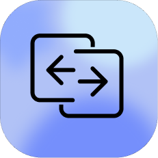

# OTPSync: Seamless Universal Clipboard

**OTPSync** is the ultimate tool to synchronize your clipboard across Android and Mac—**instantly** and **securely**. Copy on your Mac, paste on your Android. It's that simple.

> **Open Source, Secure, and Blazing Fast.**

---

## 🚀 Features

- **Instant Sync**: Copy text on one device and it’s immediately available on the other. No extra buttons or annoying persistent notifications to click on Android to send the clipboard—just copy anything normally and paste it directly on the Mac OR the other way around.
- **End-to-End Encryption**: Your data is encrypted with AES-256 (GCM) locally before it leaves your device and decrypted locally on each device before getting copied to the clipboard.
- **Cross-Platform**: Seamlessly works between **macOS** and **Android**.
- **Efficient**: Optimized for minimal battery drain and background usage.
- **Stunning UI**: Beautiful, native designs for both platforms.

---

## 🛠 Tech Stack

### macOS App
* **Language**: Swift 5.9
* **Framework**: SwiftUI & AppKit
* **Architecture**: MVVM
* **Dependencies**: Firebase, Lottie

### Android App
* **Language**: Kotlin
* **Framework**: Jetpack Compose, Material 3
* **Architecture**: MVVM / Clean Architecture
* **Dependencies**: Firebase, Coroutines, Hilt

---

## 📦 Getting Started

To keep things organized, this repository contains both client applications.

###   Installation for macOS

Since this app is not signed with a developer ID, follow these steps to install it:

1. Download the ZIP file from the repository.
2. Extract the ZIP file to a location of your choice.
3. Double-click the `.command` file included in the extracted folder to start the installation process.
4. Follow the on-screen instructions to complete the installation.

###   Installation for Android

Since this app is distributed via APK (Sideloading), you need to follow these steps to install and enable the necessary permissions, specifically for Android 13 and newer.

##### 1. Prepare for Installation
**Disable Play Protect**
Google Play Protect may block the installation since the app isn't from the Play Store.
1. Open the **Play Store**.
2. Tap your **Profile Icon** (top right) → **Play Protect**.
3. Tap **Settings (⚙️)** (top right).
4. Turn **OFF** "Scan apps with Play Protect".

##### 2. Enable Accessibility Permission (Critical Step)
OTPSync uses an Accessibility Service to detect copy events. On **Android 13+**, this setting is "Restricted" for sideloaded apps by default. Here is how to unlock it:

1. Open **OTPSync** and tap the **Accessibility** toggle.
2. If it is grayed out or shows a "Restricted Setting" popup, click **OK**.
3. Go to your phone's **Settings** → **Apps** → **OTPSync**.
4. Tap the **Three Dots (⋮)** in the top-right corner.
5. Select **Allow restricted settings**. (You may need to verify your fingerprint/PIN).
6. **Go Back** to the OTPSync app and tap the toggle again.
7. Find **OTPSync** under "Downloaded Apps" and turn it **ON**.

---

## 🔨 Building from Source

### Android

#### Prerequisites
- Android Studio (recommended) or Gradle
- JDK 17+

#### Debug APK

```bash
cd android
./gradlew assembleDebug
```

The APK will be at: `android/app/build/outputs/apk/debug/app-debug.apk`

#### Release APK

```bash
cd android
./gradlew assembleRelease
```

The APK will be at: `android/app/build/outputs/apk/release/app-release.apk`

#### Debugging

A debug script is provided for streamlined development:

```bash
cd android
./debug.sh [command]
```

| Command | Description |
|---------|-------------|
| `build` | Build and install debug APK |
| `run` | Build, install, launch, and show logs |
| `logs` | Show live app logs (filtered) |
| `logcat` | Show full system logcat |
| `crash` | Show recent crash logs |
| `wireless` | Set up wireless debugging |
| `devices` | List connected devices |
| `clear` | Clear app data |
| `uninstall` | Uninstall the app |

**Examples:**
```bash
./debug.sh run       # Full development cycle
./debug.sh logs      # Just watch logs
./debug.sh wireless  # Enable wireless debugging
```

**Setting up USB Debugging:**
1. Enable **Developer Options** on your Android device (tap Build Number 7 times)
2. Enable **USB Debugging** in Developer Options
3. Connect via USB and accept the debugging prompt on your phone

**Wireless Debugging:**
```bash
# First connect via USB, then run:
./debug.sh wireless
# Now you can unplug USB and debug over WiFi
```

### macOS

#### Prerequisites
- Xcode 15+
- macOS 14+

#### Option 1: Using Xcode (Recommended)

1. Open the project in Xcode:
   ```bash
   open mac/ClipSync.xcodeproj
   ```
2. Select your signing team in the project settings if needed
3. Press **⌘B** to build or **⌘R** to build and run

#### Option 2: Using Command Line

For a release build:
```bash
cd mac
xcodebuild -project ClipSync.xcodeproj -scheme ClipSync -configuration Release build
```

For a debug build:
```bash
cd mac
xcodebuild -project ClipSync.xcodeproj -scheme ClipSync -configuration Debug build
```

---

## 📜 License

Distributed under the **MIT License**. See `LICENSE` for more information.
